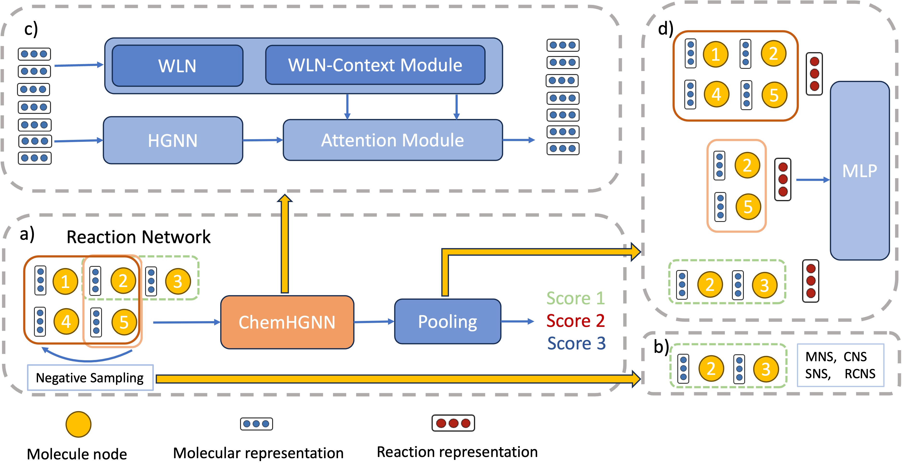

# 📘 ChemHGNN: A Hierarchical Hypergraph Neural Network for Reaction Virtual Screening and Discovery

ChemHGNN is a scalable framework for chemical reaction modeling using hierarchical hypergraph neural networks. This repository supports reproducibility of experiments presented in our study, including data preprocessing, training, and evaluation.

---

## 🔧 Setup Instructions

### ✅ Environment Requirements

- Python 3.9.21  
- CUDA 11.8  
- PyTorch 2.2.1  
- DGL for CUDA 11.8  

### 📦 Installation

1. Create a python virtual environment and activate it with:
```
python -m venv chemhgnn_env
source chemhgnn_env/bin/activate
```
2. Please install the DGL library first using command below:
```
pip install  dgl -f https://data.dgl.ai/wheels/torch-2.2/cu118/repo.html
```

3. Then install torch version 2.2.1 directly:
```
pip install torch==2.2.1
```
4. Then install the requirements.txt using the command below:
```
pip install -r requirements.txt
```
**Note**: Installation via the recommended method is essential. Errors may occur if installed differently.

## 📁 Dataset
Download the datasets from the [link](https://drive.google.com/drive/folders/1MIXddERcv0scsVF5j6LFL8fooKtL6wdx?usp=drive_link) and put it under the [data_neg_balanced_smiles](\data_neg_balanced_smiles)

preprocessing
The data is preprocessed already and dataset can be found in the data\_neg\_balanced\_smiles. Nevertheless, if you want to preprocess the data again, use the following command:


There are five splits automated generated for five-fold cross validation

## 🧠 Model architecture
[📄 View the Model architecture](pictures/pipeline_overview.pdf)


## 🚀 Training
Please use the following command:
```
python ChemHGNN.py --dataset_name hyperedge_1000  --epochs 50 --train_label mix --aggre_method sum --loss_type mse --folder_name exp_bal_1000_ecfp6_mix_sum_mse --encoding ecfp6_feat --split 2
```

After training, the result and checkpoint of the best epoch can be found at data\_neg\_balanced\_smiles/checkpoints/\$folder\_name\$

## 📓  Notebooks
Jupyter notebooks with additional experiments and ablation studies are available in directory [nbs](nbs/).

---

## Detailed Experimental Setup

### Training, Testing, Validation set selection

For all USPTO datasets (USPTO-1k, USPTO-5k, USPTO-10k), the training, validation, and test splits were selected randomly from the full dataset to ensure representative coverage of reaction types. Within each split, positive and negative samples were balanced such that the ratio of positive to negative samples (with 1/4 from each negative sampling strategy) is approximately 1:1 during both training and testing. This design helps mitigate class imbalance and ensures that the model receives sufficient examples of both outcomes for effective learning and evaluation.

**Table: Train/Validation/Test splits for USPTO datasets. Positive (Pos) and Negative (Neg) counts are reported.**

| Dataset | Train Pos | Train Neg | Train Total | Val Pos | Val Neg | Val Total | Test Pos | Test Neg | Test Total |
|---------|-----------|-----------|-------------|---------|---------|-----------|----------|----------|------------|
| USPTO-1k | 579 | 499 | 1,078 | 192 | 166 | 358 | 194 | 166 | 360 |
| USPTO-5k | 2,863 | 2,500 | 5,363 | 954 | 832 | 1,786 | 955 | 833 | 1,788 |
| USPTO-10k | 5,721 | 4,995 | 10,716 | 1,906 | 1,662 | 3,568 | 1,908 | 1,666 | 3,574 |

### Setup for HGNN and GNN Baseline Comparison

We benchmarked the models on datasets from above, which we split the training, validation and testing in a 3:1:1 ratio. We trained baseline models on a mixture of SNS, MNS, CNS, RCNS, and with NS ratio of 1:1. We evaluated the performance of the models with 5 binary classification metrics and tested with negative data generated from different NS. Additionally, we evaluate the model with whether the model collapses since some models tend to always predict one class. For the initial embedding of the nodes, we used the Morgan Fingerprint, ECFP6, to ensure they have the same initial information before the propagation.

### Setup for Benchmarking ChemHGNN

Same as the above setup. We evaluated the performance of the models with 5 binary classification metrics. Since NOCD outperforms other GNN baselines, to show the effectiveness of our ChemHGNN.

To better understand how model behavior correlates with the training dataset, we investigate the factors related to reaction type in the dataset. We classify reactions by rxnfp to 1k templates. There is a clear pattern of imbalanced class distribution where reaction template 672 dominates the data distribution in the dataset of 10k datapoints. We also observe several dominant reaction types like 586 and 274. Therefore, we construct a new dataset from the top 3 frequent reaction templates (RT 274, RT 586, RT 672) of 10k datapoints and investigate the performance.

### Setup for Benchmarking Negative Sampling

Since RCNS involves the creation of virtual nodes, we created two hypergraph reaction networks: one with the virtual nodes from RCNS, and the other without.
We benchmarked ChemHGNN trained on these two different hypergraph reaction networks in a mixed NS with RCNS and without negative sampling, and tested on MNS, CNS and SNS.

---

## Hyperparameters and Evaluation Details

### Hyperparameter Settings

The hyperparameters for our models were tuned using grid search. The selected configurations are summarized below.

**HGNN Hyperparameters**

| Parameter | Value |
|-----------|-------|
| Input size | 1024 |
| Output size | 1024 |
| Hidden dimensions | 16 |
| Dropout rate | 0.5 |
| Vertex embedding dimension | 1024 |
| GNN embedding dimension | 5 |
| Key-value dimension | 256 |
| Aggregation method | sum |
| Classification layers | [1024, 256, 16, 1] |
| Learning rate | 0.0001 |
| Batch size | 16 |
| Epochs | 50 |
| Lambda | 0.5 |

**WLN (pretrained) Hyperparameters**

| Parameter | Value |
|-----------|-------|
| Batch size | 20 |
| Hidden size | 300 |
| Max norm | 5.0 |
| Node input features | 82 |
| Edge input features | 6 |
| Node pair input features | 10 |
| Node output features | 300 |
| Number of layers | 3 |
| Number of tasks | 5 |
| Learning rate | 0.001 |
| Number of epochs | 18 |
| Decay every | 10000 |
| Learning rate decay factor | 0.9 |
