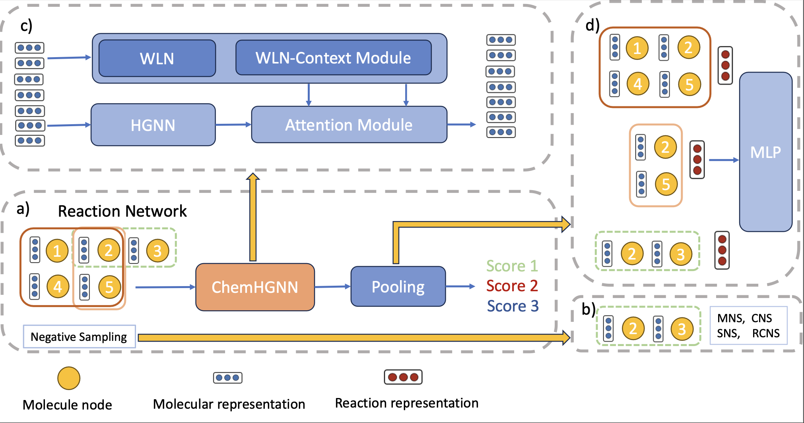

# Hypergraph_Reaction_Discovery

## How to Setup
### Environment
Create a python virtual environment and activate it with:
```
python -m venv chemhgnn_env
source chemhgnn_env/bin/activate
```
Please install the DGL library first using command below:
```
pip install  dgl -f https://data.dgl.ai/wheels/torch-2.2/cu118/repo.html
```

Then install torch version 2.2.1 directly:
```
pip install torch==2.2.1
```
Then install the requirements.txt using the command below:
```
pip install -r requirements.txt
```
**Note**: Installation via the recommended method is essential. Errors may occur if installed differently.

## Data preprocessing
The data is preprocessed already and dataset can be found in the data\_neg\_balanced\_smiles. Nevertheless, if you want to preprocess the data again, use the following command:


There are five splits automated generated for five-fold cross validation

## Model architecture
[📄 View the Model architecture](pictures/pipeline_overview.pdf)


###Training
Please use the following command:
```
python HGNN_ns_new_loss.py --dataset_name hyperedge_1000  --epochs 50 --train_label mix --aggre_method sum --loss_type mse --folder_name exp_bal_1000_ecfp6_mix_sum_mse --encoding ecfp6_feat
```

After training, the result and checkpoint of the best epoch can be found at data\_neg\_balanced\_smiles/checkpoints/\$folder\_name\$
